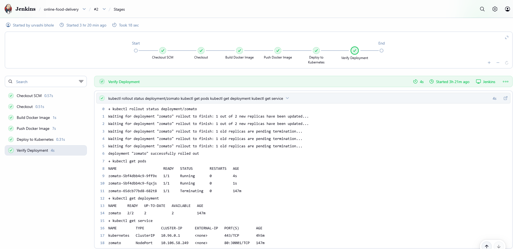
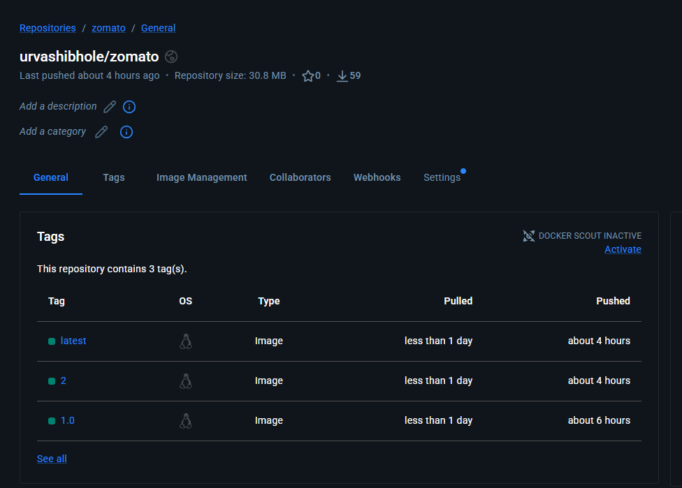
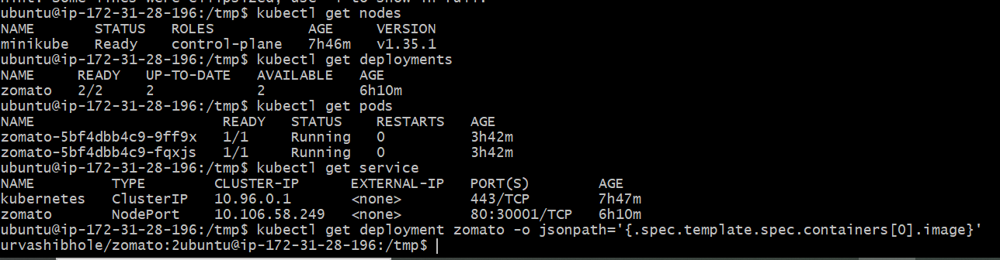
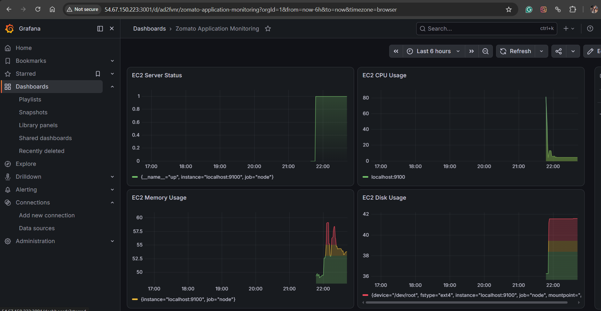

# Deployment of Online Food Ordering and Delivery Application

## Project Overview

This project demonstrates a DevOps-based deployment workflow for an online food ordering and delivery application.

The application is containerized using Docker, automated through a Jenkins CI/CD pipeline, deployed using Kubernetes, validated through the AWS EC2 public access path, and monitored using Prometheus and Grafana.

## Project Objectives

- Automate the application build and deployment process.
- Containerize the application using Docker.
- Implement a Jenkins CI/CD pipeline.
- Deploy the application using Kubernetes.
- Run multiple application replicas for availability.
- Validate the deployed application.
- Monitor infrastructure metrics using Prometheus and Grafana.

## Architecture
```text
GitHub
   |
   v
Jenkins
   |
   v
Docker Build
   |
   v
Docker Hub
   |
   v
Kubernetes / Minikube
   |
   +----------+
   |          |
   v          v
 Pod 1      Pod 2
   |          |
   +----+-----+
        |
        v
 Zomato Application


Monitoring:

AWS EC2
   |
   v
Node Exporter
   |
   v
Prometheus
   |
   v
Grafana
```
# Technologies Used
| Technology    | Purpose                            |
| ------------- | ---------------------------------- |
| Git           | Version control                    |
| GitHub        | Source code repository             |
| Jenkins       | CI/CD automation                   |
| Docker        | Application containerization       |
| Docker Hub    | Container image registry           |
| Kubernetes    | Container orchestration            |
| Minikube      | Kubernetes cluster                 |
| AWS EC2       | Cloud infrastructure               |
| Prometheus    | Metrics collection                 |
| Node Exporter | System metrics                     |
| Grafana       | Monitoring and visualization       |
| Nginx         | Serving the React production build |

# CI/CD Pipeline

The Jenkins pipeline contains the following stages:

- Checkout
- Build Docker Image
- Push Docker Image
- Deploy to Kubernetes
- Verify Deployment

# Pipeline Flow
```text
GitHub
   ↓
Jenkins Checkout
   ↓
Docker Image Build
   ↓
Push Image to Docker Hub
   ↓
Update Kubernetes Deployment
   ↓
Kubernetes Rollout
   ↓
Deployment Verification
```

The Docker image uses the Jenkins build number as the image tag.

Example:
urvashibhole/zomato:2

The latest tag is also maintained:
urvashibhole/zomato:latest

# Docker Containerization
The application is packaged using a multi-stage Docker build.

Build Stage:

Node.js is used to:-

- Install application dependencies.
- Build the React application.
- Generate the production build.

Runtime Stage:

Nginx is used to serve the generated React production files.
```text
Node.js
   ↓
npm ci
   ↓
npm run build
   ↓
React Production Build
   ↓
Nginx
   ↓
Application
```
# Docker Hub

The Docker image is published to:

urvashibhole/zomato

The repository contains versioned images and the latest image.

# Kubernetes Deployment

The application is deployed on Kubernetes using Minikube running on AWS EC2.

Deployment:
- Application name: zomato
- Replicas: 2
- Container port: 80

Service:
- Service name: zomato
- Service type: NodePort
- NodePort: 30001

The two application replicas provide basic application availability within the Kubernetes environment.

# Application Validation

After deployment, the application was successfully validated through the AWS EC2 public access path.

The Kubernetes pods were running successfully and the application returned a successful HTTP response.

# Monitoring

Monitoring was implemented using Prometheus, Node Exporter, and Grafana.

Monitoring Flow:
```text
AWS EC2
   ↓
Node Exporter
   ↓
Prometheus
   ↓
Grafana
```
# Prometheus

Prometheus collects and stores infrastructure metrics.

The configured Prometheus targets were successfully verified as UP.

# Node Exporter

Node Exporter exposes system-level metrics from the EC2 server, including CPU, memory, disk, and other system metrics.

# Grafana

Grafana uses Prometheus as the data source and provides a monitoring dashboard for visualizing infrastructure metrics.

The dashboard includes:

- Server status
- CPU utilization
- Memory utilization
- Disk utilization

# Project Results

The project successfully demonstrates:

- Automated CI/CD using Jenkins.
- Docker-based application containerization.
- Docker image publishing to Docker Hub.
- Kubernetes-based application deployment.
- Two application replicas.
- Application validation through the EC2 public access path.
- Infrastructure monitoring using Prometheus.
- System metrics collection using Node Exporter.
- Metrics visualization using Grafana.

## Project Screenshots

### Jenkins CI/CD Pipeline



### Docker Hub



### Kubernetes Deployment



### Deployed Application


### Grafana Monitoring Dashboard



# Conclusion

This project demonstrates an end-to-end DevOps workflow for deploying and monitoring an online food ordering application.

The implementation integrates GitHub, Jenkins, Docker, Docker Hub, Kubernetes, AWS EC2, Prometheus, Node Exporter, and Grafana to automate application delivery and provide infrastructure monitoring.
